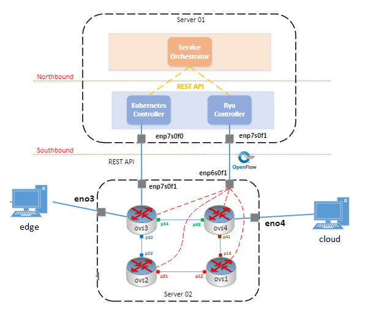

# 1.Architecture 

Mô phỏng một mạng mà có thể quản lý được toàn bộ hệ thống mạng 100%. 
Testbed gồm có 4 switch nối với nhau để tạo mô phỏng một mạng lớn hơn [swith](./switch/README.md). Những switch được điều khiển bỏi SDN controller. Chi tiết như ảnh trên.

# 2.Create database

Bước 1: Cài đặt MySQL
Bước 2: Khởi tạo database theo [hướng dẫn](./database/README.md) sau
Bước 2: Import dữ liệu trong [folder](./database/) sau

# 3.Run SDN Controller

Để khởi chạy SDN Controller làm theo bước sau [SDN Controller](./SDN/trung/mytest/README.md)

# 4. Run WebServer
## 4.1 Orchestrator webserver
Khởi chạy file python sau: [this](./webserver/ryu/mc/webserver.py)
## 4.2 SFC webserver
Khởi chạy file python sau: [this](./webserver/nguyen/run.py)

**Chú ý: Do Hiệp xóa máy ảo nên là code file SFC webserver đang là phiên cũ chưa kết nối đến Orchestrator webserver -> chính vì thế nhờ code thêm**